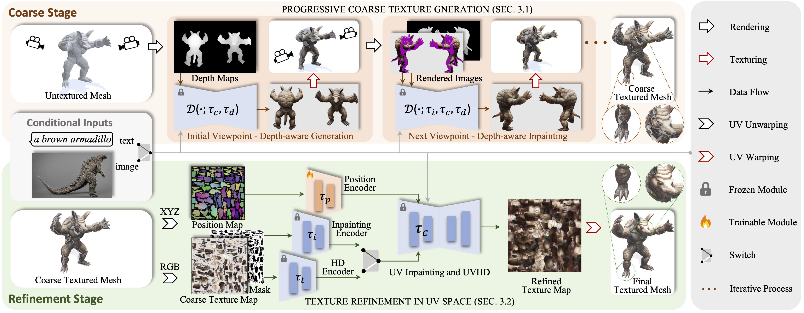

<div align="center">
    <h1> <a>Paint3D: Paint Anything 3D with Lighting-Less Texture Diffusion Models</a></h1>

<p align="center">
  <a href=https://paint3d.github.io/>Project Page</a> •
  <a href=https://arxiv.org/abs/2312.13913>Arxiv</a> •
  Demo •
  <a href="#️-faq">FAQ</a> •
  <a href="#-citation">Citation</a>
</p>

</div>


https://github.com/OpenTexture/Paint3D/assets/18525299/9aef7eeb-a783-482c-87d5-78055da3bfc0


##  Introduction

Paint3D is a novel coarse-to-fine generative framework that is capable of producing high-resolution, lighting-less, and diverse 2K UV texture maps for untextured 3D meshes conditioned on text or image inputs.

<details open="open">
    <summary><b>Technical details</b></summary>

We present Paint3D, a novel coarse-to-fine generative framework that is capable of producing high-resolution, lighting-less, and diverse 2K UV texture maps for untextured 3D meshes conditioned on text or image inputs. The key challenge addressed is generating high-quality textures without embedded illumination information, which allows the textures to be re-lighted or re-edited within modern graphics pipelines. To achieve this, our method first leverages a pre-trained depth-aware 2D diffusion model to generate view-conditional images and perform multi-view texture fusion, producing an initial coarse texture map. However, as 2D models cannot fully represent 3D shapes and disable lighting effects, the coarse texture map exhibits incomplete areas and illumination artifacts. To resolve this, we train separate UV Inpainting and UVHD diffusion models specialized for the shape-aware refinement of incomplete areas and the removal of illumination artifacts. Through this coarse-to-fine process, Paint3D can produce high-quality 2K UV textures that maintain semantic consistency while being lighting-less, significantly advancing the state-of-the-art in texturing 3D objects.


</details>

## 🚩 News
- [2024/11/05] 🔥🔥🔥 We're excited to release [MVPaint](https://github.com/3DTopia/MVPaint), a multi-view consistent texturing method that supports arbitrary UV unwrapping and high generation flexibility.
- [2024/09/26] 🎉🎉🎉 Our mesh generation method, [MeshXL](https://github.com/OpenMeshLab/MeshXL), has been accepted to NeurIPS 2024! It utilizes Paint3D to generate detailed mesh textures.
- ComfyUI node for Paint3D: [ComfyUI-Paint3D-Nodes](https://github.com/N3rd00d/ComfyUI-Paint3D-Nodes?tab=readme-ov-file) by [N3rd00d](https://github.com/N3rd00d)
- [2024/04/26] Upload code 🔥🔥🔥
- [2023/12/21] Upload paper and init project 🔥🔥🔥

## ⚡ Quick Start
### Setup
The code is tested on Centos 7 with PyTorch 1.12.1 CUDA 11.6 installed. Please follow the following steps to setup environment.
```
# install python environment
conda env create -f environment.yaml

# install kaolin
pip install kaolin==0.13.0 -f https://nvidia-kaolin.s3.us-east-2.amazonaws.com/{TORCH_VER}_{CUDA_VER}.html
```


### Txt condition
For UV-position controlnet, you can find it [here](https://huggingface.co/GeorgeQi/Paint3d_UVPos_Control).

To use the other ControlNet models, please download it from the [hugging face page](https://huggingface.co/lllyasviel), and modify the controlnet path in the config file.


Then, you can generate coarse texture via:
```
python pipeline_paint3d_stage1.py \
 --sd_config controlnet/config/depth_based_inpaint_template.yaml \
 --render_config paint3d/config/train_config_paint3d.py \
 --mesh_path demo/objs/Suzanne_monkey/Suzanne_monkey.obj \
 --outdir outputs/stage1
```

and the refined texture via:
```
python pipeline_paint3d_stage2.py \
--sd_config controlnet/config/UV_based_inpaint_template.yaml \
--render_config paint3d/config/train_config_paint3d.py \
--mesh_path demo/objs/Suzanne_monkey/Suzanne_monkey.obj \
--texture_path outputs/stage1/res-0/albedo.png \
--outdir outputs/stage2
```


Optionally, you can also generate texture results with UV position controlnet only, for example:
```
python pipeline_UV_only.py \
 --sd_config controlnet/config/UV_gen_template.yaml \
 --render_config paint3d/config/train_config_paint3d.py \
 --mesh_path demo/objs/teapot/scene.obj \
 --outdir outputs/test_teapot
```


### Image condition

With a image condition, you can generate coarse texture via:
```
python pipeline_paint3d_stage1.py \
 --sd_config controlnet/config/depth_based_inpaint_template.yaml \
 --render_config paint3d/config/train_config_paint3d.py \
 --mesh_path demo/objs/Suzanne_monkey/Suzanne_monkey.obj \
 --prompt " " \
 --ip_adapter_image_path demo/objs/Suzanne_monkey/img_prompt.png \
 --outdir outputs/img_stage1
```

and the refined texture via:
```
python pipeline_paint3d_stage2.py \
--sd_config controlnet/config/UV_based_inpaint_template.yaml \
--render_config paint3d/config/train_config_paint3d.py \
--mesh_path demo/objs/Suzanne_monkey/Suzanne_monkey.obj \
--texture_path outputs/img_stage1/res-0/albedo.png \
--prompt " " \
 --ip_adapter_image_path demo/objs/Suzanne_monkey/img_prompt.png \
--outdir outputs/img_stage2
```


### Model Converting
For checkpoints in [Civitai](https://civitai.com/) with only a .safetensor file, you can use the following script to convert and use them. 
```
python tools/convert_original_stable_diffusion_to_diffusers.py \
--checkpoint_path YOUR_LOCAL.safetensors \
--dump_path model_cvt/ \
--from_safetensors
```


<!-- <details>
  ## ▶️ Demo
  <summary><b>Webui</b></summary>


</details> -->


<!-- <details>
  ## 👀 Visualization

  ## ⚠️ FAQ

<details> <summary><b>Question-and-Answer</b></summary>

## 🧩 Projects that use Paint3D
If you develop/use Paint3D in your projects, welcome to let me know.
- [MeshXL](https://meshxl.github.io/)(accepted to NeurIPS 2024🔥) uses Paint3D to generate textures for their meshes.
- ComfyUI node for Paint3D: [ComfyUI-Paint3D-Nodes](https://github.com/N3rd00d/ComfyUI-Paint3D-Nodes?tab=readme-ov-file) by [N3rd00d](https://github.com/N3rd00d)

</details> -->


## 📖 Citation
```bib
@inproceedings{zeng2024paint3d,
  title={Paint3d: Paint anything 3d with lighting-less texture diffusion models},
  author={Zeng, Xianfang and Chen, Xin and Qi, Zhongqi and Liu, Wen and Zhao, Zibo and Wang, Zhibin and Fu, Bin and Liu, Yong and Yu, Gang},
  booktitle={Proceedings of the IEEE/CVF Conference on Computer Vision and Pattern Recognition},
  pages={4252--4262},
  year={2024}
}
```

## Acknowledgments

Thanks to [TEXTure](https://github.com/TEXTurePaper/TEXTurePaper), 
[Text2Tex](https://github.com/daveredrum/Text2Tex), 
[Stable Diffusion](https://github.com/CompVis/stable-diffusion) and [ControlNet](https://github.com/lllyasviel/ControlNet), our code is partially borrowing from them. 
Our approach is inspired by [MotionGPT](https://github.com/OpenMotionLab/MotionGPT), [Michelangelo](https://neuralcarver.github.io/michelangelo/) and [DreamFusion](https://dreamfusion3d.github.io/).

## License

This code is distributed under an [Apache 2.0 LICENSE](LICENSE).

Note that our code depends on other libraries, including [PyTorch3D](https://pytorch3d.org/) and [PyTorch Lightning](https://lightning.ai/), and uses datasets which each have their own respective licenses that must also be followed.
